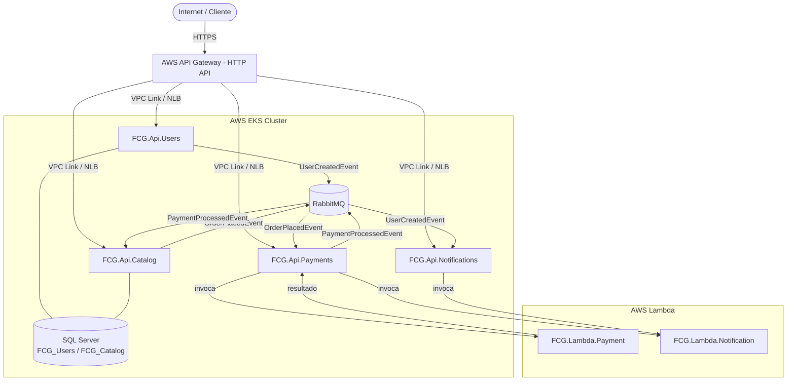
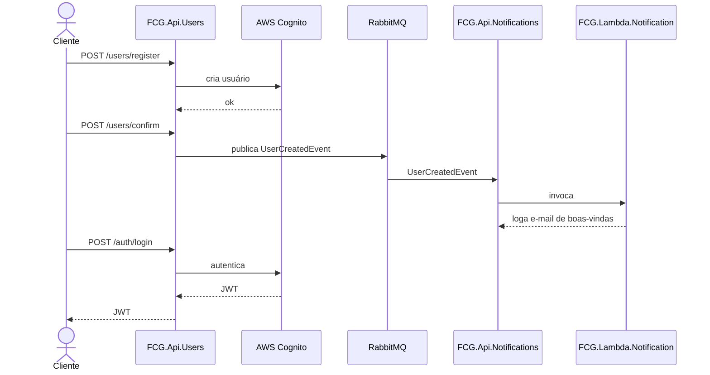
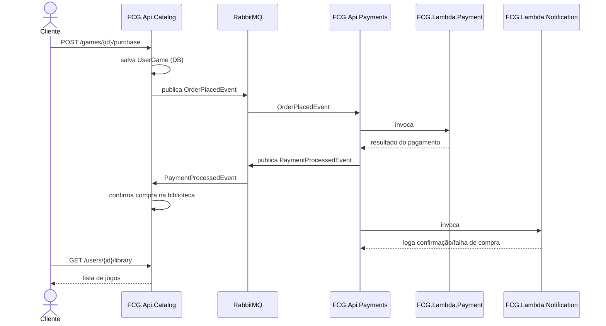

# Arquitetura — FIAP Cloud Games (Fase 3)

## Desenho da Arquitetura

---

## Fluxo de Comunicação entre Microsserviços

### Fluxo 1 — Cadastro de Usuário

### Fluxo 2 — Compra de Jogo

### Resumo dos Eventos

| Evento                  | Publicado por        | Consumido por           |
|-------------------------|----------------------|-------------------------|
| `UserCreatedEvent`      | FCG.Api.Users        | FCG.Api.Notifications                   |
| `OrderPlacedEvent`      | FCG.Api.Catalog      | FCG.Api.Payments                        |
| `PaymentProcessedEvent` | FCG.Api.Payments     | FCG.Api.Catalog                         |

### Invocações de Lambda

| Chamador                | Lambda invocada          |
|-------------------------|--------------------------|
| FCG.Api.Payments        | FCG.Lambda.Payment       |
| FCG.Api.Payments        | FCG.Lambda.Notification  |
| FCG.Api.Notifications   | FCG.Lambda.Notification  |
