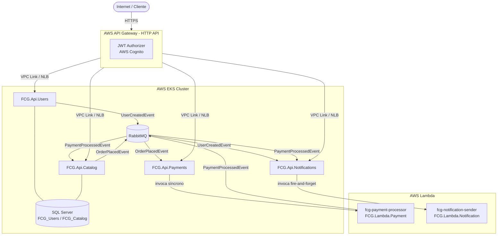

# Arquitetura — FIAP Cloud Games (Fase 3)

## Desenho da Arquitetura



---

## Fluxo de Comunicação entre Microsserviços

### Fluxo 1 — Cadastro de Usuário

```
Cliente
  │
  ├─► POST /users/api/users/register    → FCG.Api.Users → AWS Cognito (cria usuário)
  │
  ├─► POST /users/api/users/confirm     → FCG.Api.Users
  │                                          │
  │                                          └─► publica UserCreatedEvent → RabbitMQ
  │                                                    │
  │                                                    └─► FCG.Api.Notifications
  │                                                          (UserCreatedEventConsumer)
  │                                                          └─► invoca FCG.Lambda.Notification
  │                                                                (EventType: "UserCreated")
  │                                                                → loga e-mail de boas-vindas
  │
  └─► POST /users/api/auth/login        → FCG.Api.Users → AWS Cognito → retorna JWT
```

### Fluxo 2 — Compra de Jogo

```
Cliente (com JWT)
  │
  ├─► POST /catalog/api/games/{id}/purchase  → FCG.Api.Catalog
  │                                               │
  │                                               ├─► salva UserGame (FCG_Catalog DB)
  │                                               └─► publica OrderPlacedEvent → RabbitMQ
  │
  │   RabbitMQ
  │     └─► FCG.Api.Payments (OrderPlacedEventConsumer)
  │               │
  │               └─► invoca FCG.Lambda.Payment (síncrono / RequestResponse)
  │                         │
  │                         ├─► simula pagamento
  │                         └─► retorna PaymentResult (Success/Failure)
  │
  │         FCG.Api.Payments publica PaymentProcessedEvent → RabbitMQ
  │                   │
  │                   ├─► FCG.Api.Catalog (PaymentProcessedEventConsumer)
  │                   │         └─► confirma compra na biblioteca do usuário
  │                   │
  │                   └─► FCG.Api.Notifications (PaymentProcessedEventConsumer)
  │                               └─► invoca FCG.Lambda.Notification
  │                                         (EventType: "PaymentProcessed")
  │                                         → loga confirmação/falha de compra
  │
  └─► GET /catalog/api/users/{id}/library  → FCG.Api.Catalog → retorna jogos do usuário
```

### Resumo dos Eventos

| Evento                  | Publicado por        | Consumido por                                      |
|-------------------------|----------------------|----------------------------------------------------|
| `UserCreatedEvent`      | FCG.Api.Users        | FCG.Api.Notifications                              |
| `OrderPlacedEvent`      | FCG.Api.Catalog      | FCG.Api.Payments                                   |
| `PaymentProcessedEvent` | FCG.Api.Payments     | FCG.Api.Catalog, FCG.Api.Notifications             |

### Invocações diretas (AWS Lambda SDK)

| Chamador                | Lambda invocada             | Tipo                       |
|-------------------------|-----------------------------|----------------------------|
| FCG.Api.Payments        | FCG.Lambda.Payment          | Síncrono (RequestResponse) |
| FCG.Api.Notifications   | FCG.Lambda.Notification     | Fire-and-forget (Event)    |
